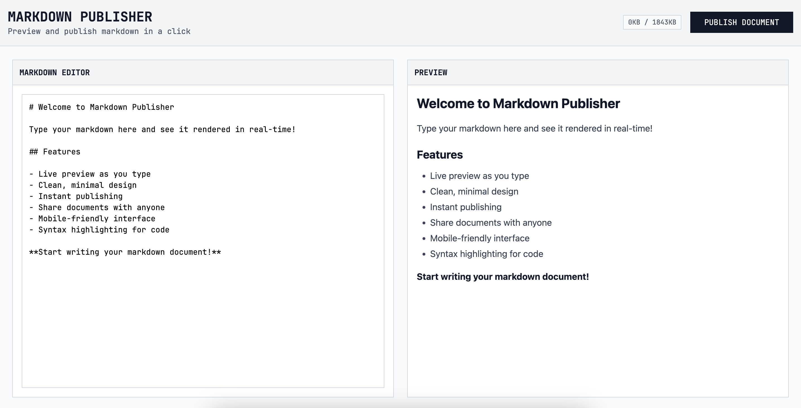

# Markdown Publisher

A website to preview and publish Markdown files. Built on Cloudflare Workers.



## What it does
- Creates shareable links for markdown documents  
- AI content filtering + syntax highlighting
- Rate limiting: 10 req/min, 50 operations/day per IP
- Security headers and XSS protection

## Quick start
```bash
npm install
npm run dev
```

Visit `http://localhost:5173` to start publishing.

## How to use
1. **Paste markdown** at the home page
2. **Click "Publish"** to generate a shareable link  
3. **Share the URL** with anyone
4. **View documents** via their permanent URLs

## Deploy
```bash
# Login to Cloudflare
npx wrangler login

# Deploy to production  
npm run deploy
```

Requires Cloudflare D1 database and AI bindings (configured in `wrangler.jsonc`).

Built with React Router v7, TypeScript, and Cloudflare Workers.
